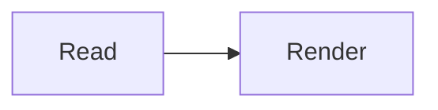

# SimpleMD parser in Quick Look

## Highlighted code

```js
const answer = 42;
function square(x) { return x * x; }
```

## KaTeX math

$$\frac{a+b}{c} = x^2$$

## Diagram fallback


```mermaid
graph LR
  Read --> Render
```
